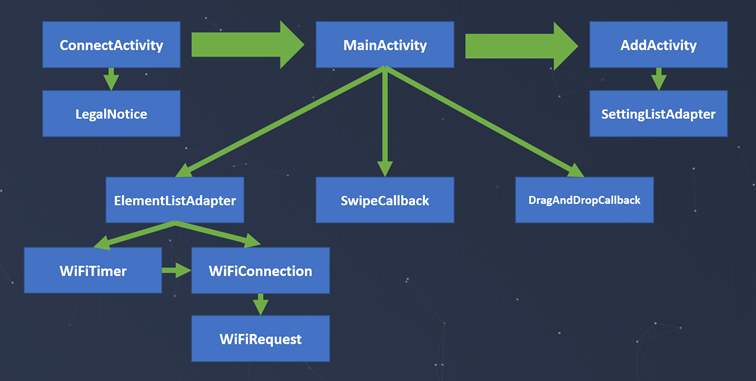

# VHDPlus Remote App
Written in Java with Android Studio</br>
Designed for VHDPlus WiFi Extension

- This app can send and receive data via http requests
- You can select the IP (or URL) and port
- Request format for sending data:
```
http://[ip address (+ port)]/send?b=hook1       -> Button with hook "hook1" pressed
http://[ip address (+ port)]/send?s=hook2~1     -> "hook2" Switch enabled
http://[ip address (+ port)]/send?i=hook3~50    -> "hook3" Slider set to 50
http://[ip address (+ port)]/send?c=hook4~text  -> "hook4" console send "text"
```
- Response format:
```
Button, Switch and Slider: OK
-> Could be everything that does not include the letter 'C' or 'R'
Console: C~text
-> Text of last console where the send button was pressed will be changed to "text"
```

- Request format for requesting data: 
```
http://[ip address (+ port)]/read?hooks=~l_hook1~r_hook2~d_hook3~c_hook4
-> LED with hook "hook1", RGB LED with "hook2", display with "hook3", console with "hook4"
```
- Response format:
```
R~1~#FF0000~text~text2
-> LED is on, RGB LED is red, display has text "text" and console displays text "text2"
```

# Overview


